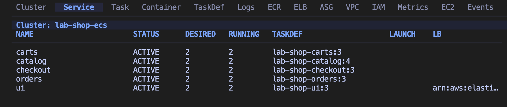
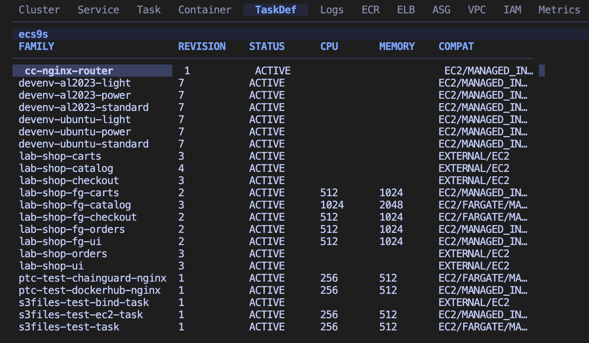
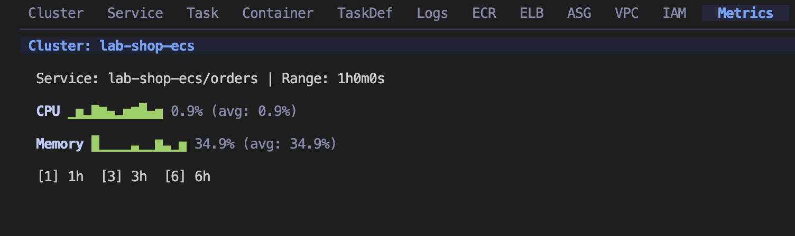
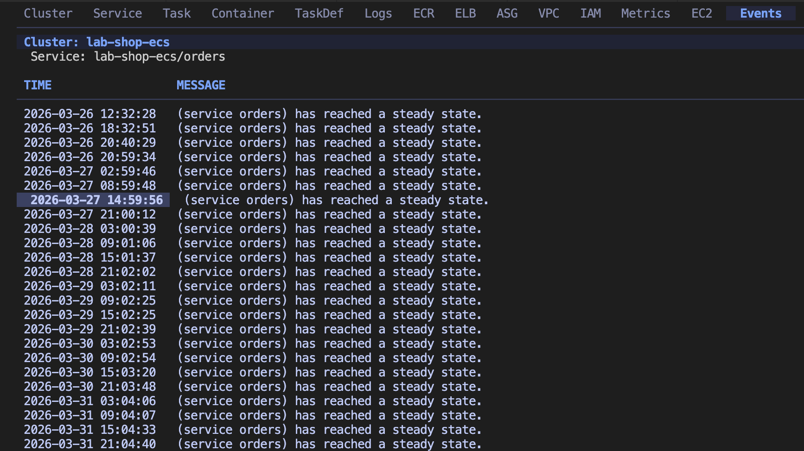
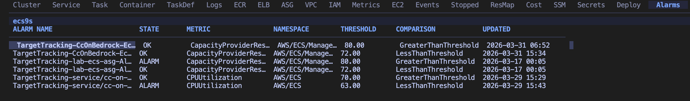

# ecs9s

[](LICENSE)
[](https://go.dev)
[]()
[](#english)
[](#한국어)

A terminal UI for managing AWS ECS clusters and related services / AWS ECS 클러스터와 관련 서비스를 관리하는 터미널 UI

---

# English

## Overview

ecs9s is a keyboard-driven terminal UI for AWS ECS operations. It provides a unified interface for managing clusters, services, tasks, containers, and related AWS services — all from your terminal. Inspired by [k9s](https://github.com/derailed/k9s) (Kubernetes), [e1s](https://github.com/keidarcy/e1s) (ECS), and [tui-aws](https://github.com/whchoi98/tui-aws) (AWS).

### Service View



### Task Definitions



### Metrics (CPU / Memory Sparkline)



### Service Events



### CloudWatch Alarms



## Features

- **21 resource views** — ECS core (Cluster, Service, Task, Container, TaskDef) plus operational services (Logs, ECR, ELB, ASG, VPC, IAM, Metrics, EC2, Events, Stopped Tasks, Resource Map, Cost, SSM, Secrets, Deploy History, Alarms)
- **Hybrid navigation** — Tab-based switching and k9s-style command mode (`:cluster`, `:service`, `:ecr`, etc.)
- **Drill-down exploration** — Cluster to Service to Task to Container with breadcrumb history
- **ECS Exec shell access** — Interactive shell into containers with prerequisite validation
- **Operational actions** — Force deploy, scale, rollback, stop task, port forwarding, enable ECS Exec
- **3 preset themes** — Dark (Tokyo Night), Light, Blue (Navy)
- **Single binary** — `go build` produces one portable executable

## Prerequisites

- Go 1.24+
- AWS credentials configured (`~/.aws/credentials` or environment variables)
- `session-manager-plugin` (required for ECS Exec shell access)

## Installation

```bash
# Clone the repository
git clone https://github.com/whchoi98/ecs9s.git
cd ecs9s

# Build
go build -o ecs9s .

# (Optional) Install to PATH
sudo mv ecs9s /usr/local/bin/
```

## Usage

```bash
# Run with default AWS profile and region
./ecs9s

# Specify profile and region
./ecs9s --profile myprofile --region ap-northeast-2

# Use a different theme
./ecs9s --theme light    # dark | light | blue

# Show version
./ecs9s --version
```

### Navigation Keys

| Key | Action |
|-----|--------|
| `Tab` / `[` / `]` | Switch tabs |
| `:` + command | Command mode (`:cluster`, `:ecr`, `:cost`, etc.) |
| `Enter` | Drill down (Cluster → Service → Task → Container) |
| `Esc` / `Backspace` | Go back |
| `/` | Filter current table |
| `s` | Sort columns |
| `R` | Refresh |
| `?` | Help overlay |
| `q` | Quit |

### Page Actions

| Page | Key | Action |
|------|-----|--------|
| Service | `f` | Force new deployment |
| Service | `e` | Enable ECS Exec |
| Service | `S` | Scale desired count |
| Service | `b` | Rollback to previous task definition |
| Task | `Ctrl+d` | Stop task |
| Container | `x` | ECS Exec (interactive shell) |
| Container | `Ctrl+f` | Port forwarding |
| TaskDef | `Ctrl+d` | Deregister task definition |

### ECS Exec Shell Access

1. Select a service and press `e` to enable ECS Exec (sets `enableExecuteCommand` and triggers force deploy)
2. Wait for new tasks to start with ExecuteCommandAgent
3. Drill down to Container and press `x` to open an interactive shell

Required IAM permissions on Task Role:

```
ssmmessages:CreateControlChannel
ssmmessages:CreateDataChannel
ssmmessages:OpenControlChannel
ssmmessages:OpenDataChannel
```

## Configuration

Config file location: `~/.ecs9s/config.yaml`

```yaml
aws:
  profile: default
  region: ap-northeast-2
theme: dark    # dark | light | blue
```

CLI flags override config file values.

## Project Structure

```
ecs9s/
├── main.go                     # Entry point (CLI flags, config load)
├── internal/
│   ├── app/                    # Root bubbletea model, routing
│   ├── ui/
│   │   ├── components/         # Table, tabs, commandbar, statusbar, help, confirm, logviewer, sparkline
│   │   ├── pages/              # 21 page models (one per resource view)
│   │   └── styles/             # Lipgloss theme-based styles
│   ├── aws/                    # AWS SDK v2 clients (10 services)
│   ├── action/                 # ECS Exec, port forward, scale, deploy, rollback
│   ├── config/                 # YAML config loader
│   └── theme/                  # Dark, Light, Blue presets
├── tests/                      # TAP structure tests + hook behavior tests
├── scripts/                    # Setup and utility scripts
└── .github/workflows/          # CI pipeline
```

## Testing

```bash
# Run Go unit tests
go test ./... -v

# Run project structure tests (TAP format)
bash tests/run-all.sh

# Run hook behavior tests
bash tests/hooks/test-secret-scan.sh
```

## Contributing

1. Fork this repository
2. Create a feature branch (`git checkout -b feat/amazing-feature`)
3. Commit your changes (`git commit -m 'feat: add amazing feature'`)
4. Push to the branch (`git push origin feat/amazing-feature`)
5. Open a Pull Request

Use [Conventional Commits](https://www.conventionalcommits.org/) format: `feat:`, `fix:`, `docs:`, `refactor:`, `test:`, `chore:`.

## License

This project is licensed under the MIT License. See the [LICENSE](LICENSE) file for details.

## Contact

- Maintainer: [WooHyung Choi](https://github.com/whchoi98)
- Issues: [GitHub Issues](https://github.com/whchoi98/ecs9s/issues)
- Email: whchoi98@gmail.com

---

# 한국어

## 개요

ecs9s는 AWS ECS 운영을 위한 키보드 기반 터미널 UI입니다. 클러스터, 서비스, 태스크, 컨테이너 및 관련 AWS 서비스를 터미널에서 통합 관리할 수 있습니다. [k9s](https://github.com/derailed/k9s) (Kubernetes), [e1s](https://github.com/keidarcy/e1s) (ECS), [tui-aws](https://github.com/whchoi98/tui-aws) (AWS)에서 영감을 받았습니다.

### Service 뷰


### Task Definition 목록


### 메트릭 (CPU / Memory 스파크라인)


### 서비스 이벤트


### CloudWatch 알람


## 주요 기능

- **21개 리소스 뷰** — ECS 핵심 (Cluster, Service, Task, Container, TaskDef) + 운영 서비스 (Logs, ECR, ELB, ASG, VPC, IAM, Metrics, EC2, Events, Stopped Tasks, Resource Map, Cost, SSM, Secrets, Deploy History, Alarms)
- **하이브리드 네비게이션** — Tab 기반 전환과 k9s 스타일 명령 모드 (`:cluster`, `:service`, `:ecr` 등)
- **드릴다운 탐색** — Cluster에서 Service, Task, Container로 계층 탐색 (이력 관리)
- **ECS Exec 셸 접속** — 컨테이너 내 인터랙티브 셸 (사전 요건 자동 검증)
- **운영 액션** — 강제 배포, 스케일링, 롤백, 태스크 중지, 포트 포워딩, ECS Exec 활성화
- **3가지 프리셋 테마** — Dark (Tokyo Night), Light, Blue (Navy)
- **단일 바이너리** — `go build`로 하나의 실행 파일 생성

## 사전 요구 사항

- Go 1.24+
- AWS 자격 증명 설정 (`~/.aws/credentials` 또는 환경 변수)
- `session-manager-plugin` (ECS Exec 셸 접속에 필요)

## 설치 방법

```bash
# 레포지토리 클론
git clone https://github.com/whchoi98/ecs9s.git
cd ecs9s

# 빌드
go build -o ecs9s .

# (선택) PATH에 설치
sudo mv ecs9s /usr/local/bin/
```

## 사용법

```bash
# 기본 AWS 프로파일과 리전으로 실행
./ecs9s

# 프로파일과 리전 지정
./ecs9s --profile myprofile --region ap-northeast-2

# 테마 변경
./ecs9s --theme light    # dark | light | blue

# 버전 확인
./ecs9s --version
```

### 네비게이션 키

| 키 | 동작 |
|----|------|
| `Tab` / `[` / `]` | 탭 전환 |
| `:` + 명령어 | 명령 모드 (`:cluster`, `:ecr`, `:cost` 등) |
| `Enter` | 드릴다운 (Cluster → Service → Task → Container) |
| `Esc` / `Backspace` | 뒤로 가기 |
| `/` | 현재 테이블 필터링 |
| `s` | 컬럼 정렬 |
| `R` | 새로고침 |
| `?` | 도움말 오버레이 |
| `q` | 종료 |

### 페이지별 액션

| 페이지 | 키 | 동작 |
|--------|-----|------|
| Service | `f` | 강제 재배포 |
| Service | `e` | ECS Exec 활성화 |
| Service | `S` | Desired Count 조정 |
| Service | `b` | 이전 태스크 정의로 롤백 |
| Task | `Ctrl+d` | 태스크 중지 |
| Container | `x` | ECS Exec (인터랙티브 셸) |
| Container | `Ctrl+f` | 포트 포워딩 |
| TaskDef | `Ctrl+d` | 태스크 정의 등록 해제 |

### ECS Exec 셸 접속

1. 서비스를 선택하고 `e`를 눌러 ECS Exec를 활성화합니다 (`enableExecuteCommand` 설정 + 강제 배포)
2. ExecuteCommandAgent가 포함된 새 태스크가 시작될 때까지 대기합니다
3. Container로 드릴다운한 후 `x`를 눌러 인터랙티브 셸을 엽니다

Task Role에 필요한 IAM 권한:

```
ssmmessages:CreateControlChannel
ssmmessages:CreateDataChannel
ssmmessages:OpenControlChannel
ssmmessages:OpenDataChannel
```

## 환경 설정

설정 파일 위치: `~/.ecs9s/config.yaml`

```yaml
aws:
  profile: default
  region: ap-northeast-2
theme: dark    # dark | light | blue
```

CLI 플래그가 설정 파일 값보다 우선합니다.

## 프로젝트 구조

```
ecs9s/
├── main.go                     # 엔트리 포인트 (CLI 플래그, 설정 로드)
├── internal/
│   ├── app/                    # 루트 bubbletea 모델, 라우팅
│   ├── ui/
│   │   ├── components/         # 테이블, 탭, 명령바, 상태바, 도움말, 확인, 로그뷰어, 스파크라인
│   │   ├── pages/              # 21개 페이지 모델 (리소스별 1개)
│   │   └── styles/             # Lipgloss 테마 기반 스타일
│   ├── aws/                    # AWS SDK v2 클라이언트 (10개 서비스)
│   ├── action/                 # ECS Exec, 포트 포워딩, 스케일, 배포, 롤백
│   ├── config/                 # YAML 설정 로더
│   └── theme/                  # Dark, Light, Blue 프리셋
├── tests/                      # TAP 구조 테스트 + 훅 동작 테스트
├── scripts/                    # 설정 및 유틸리티 스크립트
└── .github/workflows/          # CI 파이프라인
```

## 테스트

```bash
# Go 단위 테스트 실행
go test ./... -v

# 프로젝트 구조 테스트 실행 (TAP 형식)
bash tests/run-all.sh

# 훅 동작 테스트 실행
bash tests/hooks/test-secret-scan.sh
```

## 기여 방법

1. 이 레포지토리를 Fork합니다
2. 기능 브랜치를 생성합니다 (`git checkout -b feat/amazing-feature`)
3. 변경 사항을 커밋합니다 (`git commit -m 'feat: add amazing feature'`)
4. 브랜치에 Push합니다 (`git push origin feat/amazing-feature`)
5. Pull Request를 생성합니다

커밋 메시지는 [Conventional Commits](https://www.conventionalcommits.org/) 형식을 따릅니다: `feat:`, `fix:`, `docs:`, `refactor:`, `test:`, `chore:`.

## 라이선스

이 프로젝트는 MIT 라이선스로 배포됩니다. 자세한 내용은 [LICENSE](LICENSE) 파일을 참조하세요.

## 연락처

- 메인테이너: [WooHyung Choi](https://github.com/whchoi98)
- 이슈: [GitHub Issues](https://github.com/whchoi98/ecs9s/issues)
- 이메일: whchoi98@gmail.com
